::: {style="text-align: right;"}
[](https://www.gnu.org/licenses/agpl-3.0.en.html) [](http://creativecommons.org/licenses/by-sa/4.0/)
:::


# Getting Started

GitHub has a file-size limit for individual files (~ 5MB). Since the smallest raw .fcs file in the dataset being used for the [TRU-OLS](/course/community/TRU-OLS/index.qmd) walkthrough was 23 MB, the dataset needed to be cleaned up and downsampled before inclusion as an example dataset. 

Consequently we will first gate for singlets, non-RBCs and lymphocyte scatter. Once this has been accomplished, we will downsample for 17500 of the present cells, which will result in being just under the 5 MB limit when using 5-laser Cytek Aurora raw .fcs files. 

As always, start by loading the required R packages via the `library()` call. 

```{r}
library(flowWorkspace)
library(flowGate)
library(dplyr)
library(purrr)
```

Next, activate the `Downsampling()` function that was created as part of [Week 10](/course/10_Downsampling/index.qmd) of the course.

```{r}
RFolder <- file.path("course", "community", "TRU-OLS",  "R") # For Interactive
# RFolder <- file.path("R") # For Quarto Rendering
MyFunctions <- list.files(RFolder, full.names=TRUE)
purrr::walk(.x=MyFunctions, .f=source)
```

With this done, specify your input file.path and output file.paths 

```{r}
#StorageLocation <- file.path("course", "community", "TRU-OLS", "data")
StorageLocation <- file.path("data")

#OutputLocation <- file.path("course", "community", "TRU-OLS", "outputs")
OutputLocation <- file.path("outputs")
```

And proceed to load in the .fcs files to a GatingSet. 

```{r}
fcs_files <- list.files(StorageLocation, pattern=".fcs",
 full.names=TRUE, recursive=TRUE)

SFC_cytoset <- load_cytoset_from_fcs(fcs_files,
 truncate_max_range=FALSE, transformation=FALSE)
SFC_GatingSet <- GatingSet(SFC_cytoset)
```

As we will be working with raw .fcs files today, we do not need to transform. If we did need to, we would use the following code (modifying the arguments to match our own instrument settings).

```{r}
#| eval: FALSE

SFC_Parameters <- colnames(SFC_GatingSet)
FluorophoresOnly <- SFC_Parameters[!stringr::str_detect(SFC_Parameters, "FSC|SSC|Time")]

Biexponential <- flowjo_biexp_trans(channelRange=4096, maxValue=262144,
     pos=4.5, neg=2, widthBasis=-750)
MyBiexTransform <- transformerList(FluorophoresOnly, Biexponential)
transform(SFC_GatingSet, MyBiexTransform)
```

Next, we will create gates using the `flowGate` package, as covered during [Week 08](/course/08_WaysToGate/index.qmd#manual---flowgate), specifically via the iteration table.

```{r}
GatingTable <- tibble::tribble(
  ~filterId,    ~dims,                          ~subset,      
  "singlets",   list("FSC-A", "FSC-H"),          "root",  
  "nonRBCs",     list("SSC-A", "SSC-B-A"),    "singlets",
  "scatter",    list("FSC-A", "SSC-A"),      "nonRBCs",  
)
```

We can then run the following line of code, and proceed to sequentially draw the gates via the ShinyApp

```{r}
#| eval: FALSE
flowGate::gs_apply_gating_strategy(SFC_GatingSet, gating_strategy = GatingTable)
```

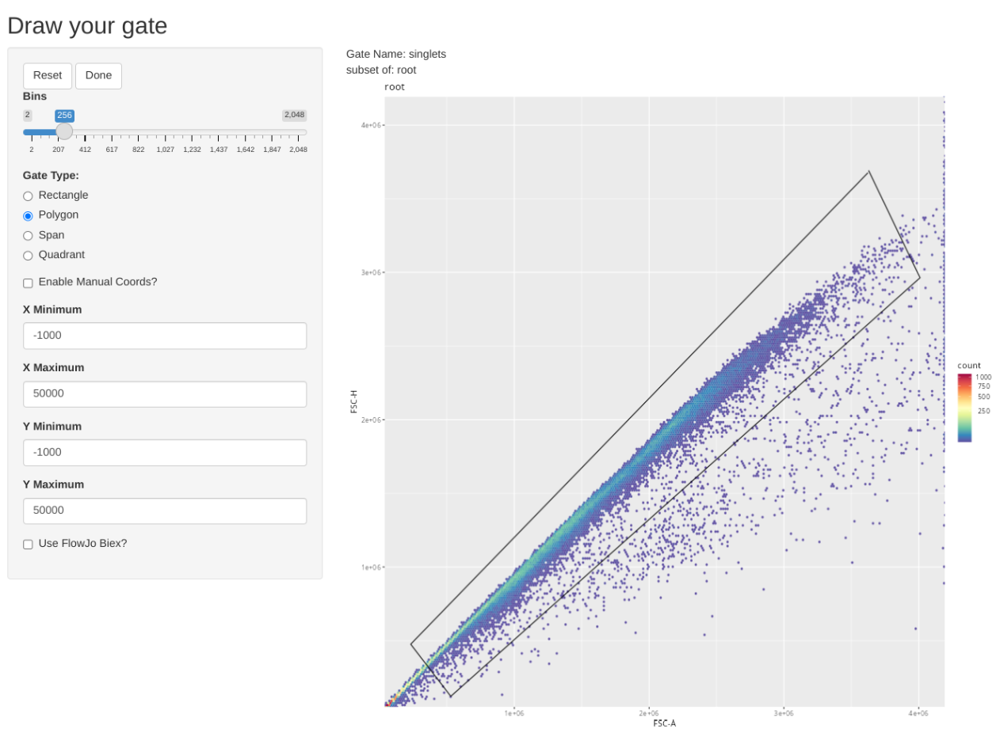

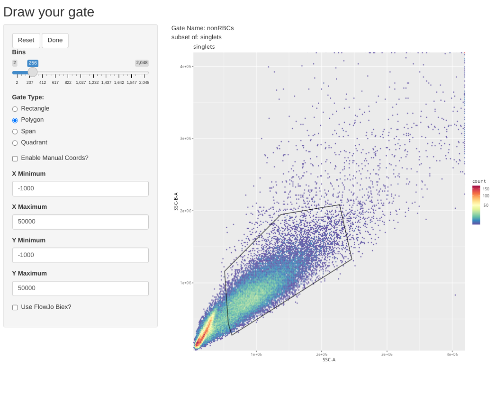

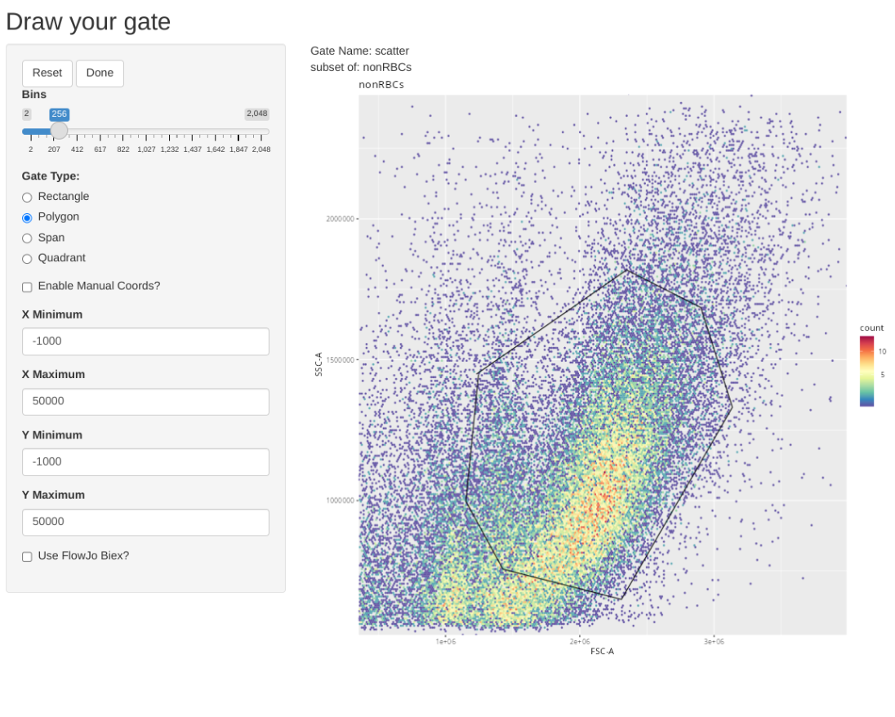

Once the gates are drawn, we can quickly validate that the gate placements will suffice for what we are trying to accomplish today. We can use the `Utility_UnityPlots()` from the `Luciernaga` package to compare the same gate across all specimens


```{r}
#| eval: FALSE
library(Luciernaga)

Plot <- Utility_UnityPlot(x="FSC-A", y="FSC-H",
 GatingSet=SFC_GatingSet, sample.name="GUID", bins=70,
 removestrings=".fcs", marginsubset="root", gatesubset="singlets", returntype="patchwork", reference=NULL, clearance=0.2, gatelines=FALSE)

Plot2 <- Utility_UnityPlot(x="SSC-A", y="SSC-B-A",
 GatingSet=SFC_GatingSet, sample.name="GUID", bins=70,
 removestrings=".fcs", marginsubset="singlets", gatesubset="nonRBCs", returntype="patchwork", reference=NULL, clearance=0.2, gatelines=FALSE)

Plot3 <- Utility_UnityPlot(x="FSC-A", y="SSC-A",
 GatingSet=SFC_GatingSet, sample.name="GUID", bins=70,
 removestrings=".fcs", marginsubset="singlets", gatesubset="scatter", returntype="patchwork", reference=NULL, clearance=0.2, gatelines=FALSE)
```

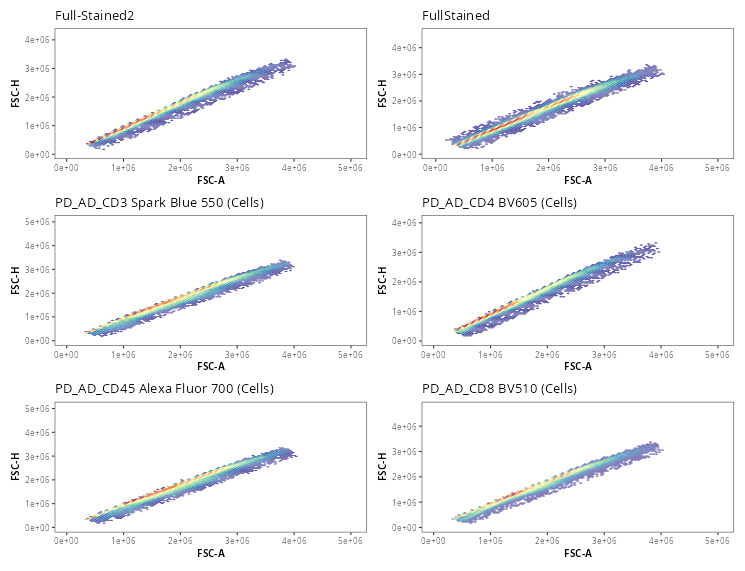

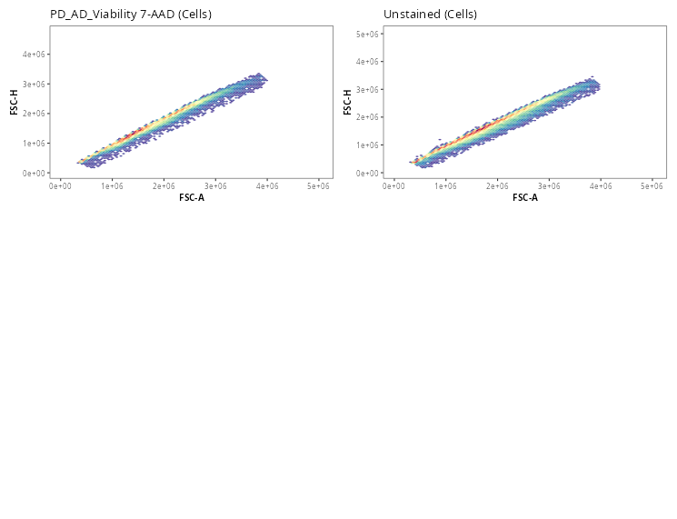

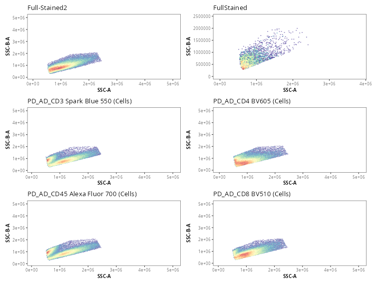

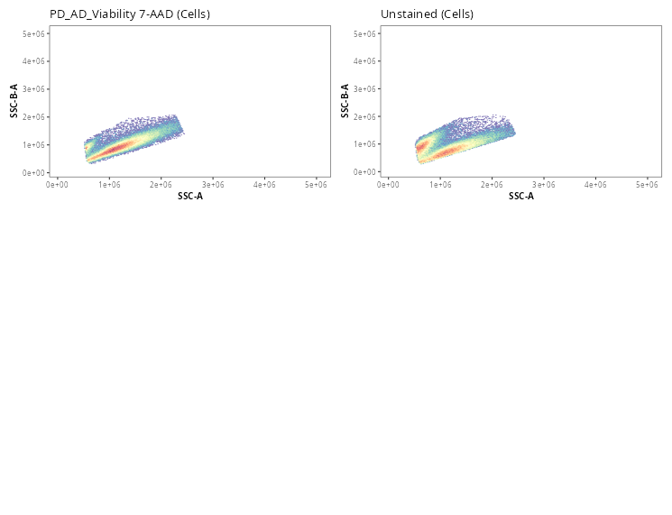

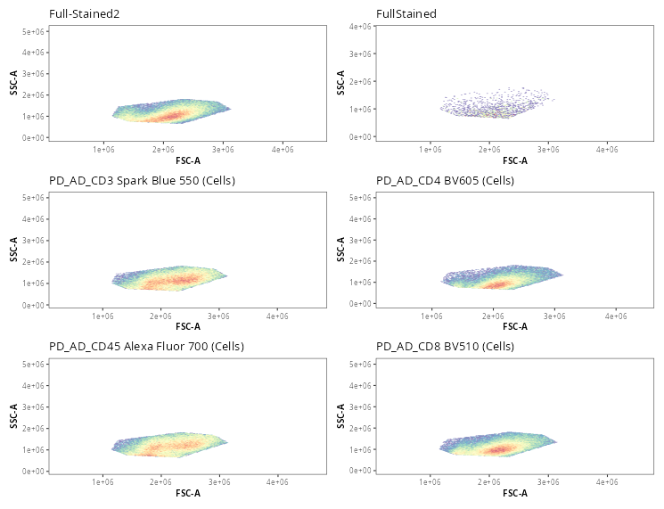

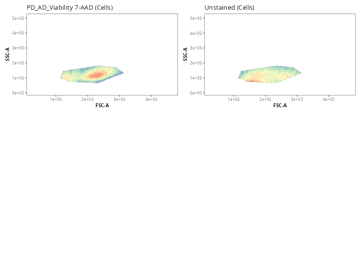

With the gates reasonably enough placed (except for the Full-Stained 1 specimen), lets proceed and see what we have for counts. 

```{r}
#| eval: FALSE
Counts <- gs_pop_get_count_fast(SFC_GatingSet, "count")
Counts$Population <- basename(Counts$Population)
Counts |> filter(Population %in% "scatter")
```

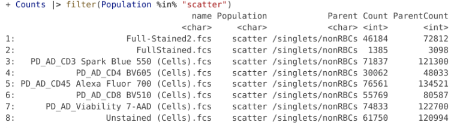

For a raw .fcs file from a 5-laser Cytek Aurora, downsampling to 17500 cells puts us just under the 5 MB limit. Seeing as we have enough cells, lets proceed to export out the downsampled .fcs files to our output folder. 

```{r}
#| eval: FALSE
purrr::walk(.x=SFC_GatingSet, subset="scatter", .f=Downsampling,
 DownsampleCount=17500, addon="scatter", returnType="fcs",
 StorageLocation=OutputLocation)
```

# Proceeding

The resulting files are now under 5 MB. I proceeded to remove the original ones from the "data" folder, and replaced them with the files from the outputs folder. These were then transferred to GitHub for use in this walk-through example.

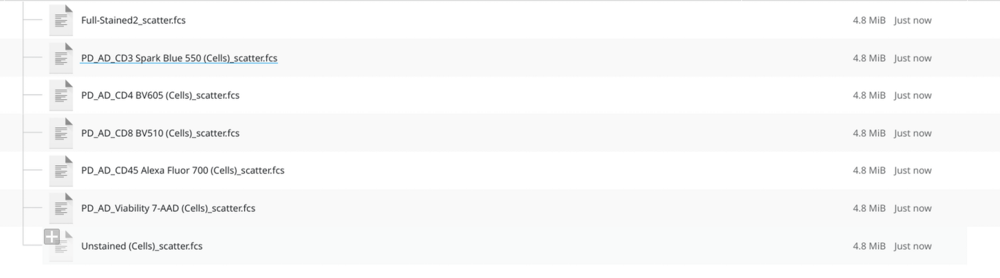

To return to where you were in the TRU-OLS walk-through, click [here](/course/community/TRU-OLS/index.qmd#ols-unmixing-via-luciernaga)

::: {style="text-align: right;"}
[](https://www.gnu.org/licenses/agpl-3.0.en.html) [](http://creativecommons.org/licenses/by-sa/4.0/)
:::
