::: {style="text-align: right;"}
[](https://www.gnu.org/licenses/agpl-3.0.en.html) [](http://creativecommons.org/licenses/by-sa/4.0/)
:::

For the YouTube livestream schedule, see [here](https://www.youtube.com/@cytometryinr)

For screen-shot slides, click [here]()

{width="50%"}

<br>

---

# Background

There are different ways to unmix spectral flow cytometry data. [TRU-OLS](https://github.com/De-Novo-Research/TRU-OLS) is one of them, with the methodology behind the approach explained in this 2025 [Cyto Part A](https://onlinelibrary.wiley.com/doi/10.1002/cyto.a.24957) paper by [Ryan Kmet](https://github.com/ryankmet1) and [David Novo](https://orcid.org/0000-0003-1713-0605).

## Logistics

It is implemented in the [Julia](https://julialang.org/) programming language. Since this is a Cytometry in R course (and I have no plans to implement a Cytometry in Julia course), we will need to figure out a few logistics first. Namely...

- We will need to retrieve the information we need for unmixing from the raw .fcs files in R
- Hand off these intermediate outputs to Julia (either directly or via the `JuliaCall` R package)
- After unmixing has been carried out, return these outputs to R, and integrate them back into a properly formatted .fcs file

In this walk-through, we will see a basic example of how this can be implemented, leveraging what we know about the R programming language, plus select targeted google searches, to allow us to pass what is needed to Julia, and then get the returned objects back into R. 

If we manage to get these three goals accomplished, we will be able to unmix our data using TRU-OLS, and end up will properly set up .fcs files that can be opened with any flow cytometry software. 

## Method

:::{.callout-note}
The following notes about TRU-OLS arose as part of a [Cytometry Discord](https://www.reddit.com/r/flowcytometry/comments/1dccpjb/announcing_the_flow_cytometry_discord_server/) discussion thread within the "data" channel on August 25, 2025 discussing the released [paper](https://onlinelibrary.wiley.com/doi/10.1002/cyto.a.24957). As a community "Journal Club", some important details may have been missed. All screenshots (and badly hand-scrawled notes) originate from the paper figures. The thread is reposted below with minimal editing. 
:::

Background: As we increase number of markers in the unmixing matrix, variance contributes to increasing amounts of noise around the negative population. This was illustrated recently in the [Mair and Mage](https://www.biorxiv.org/content/10.1101/2025.04.17.649396v2) paper. For the unstained sample iteratively unmixed up to 40 markers, you can see how this spreads out. 1/n

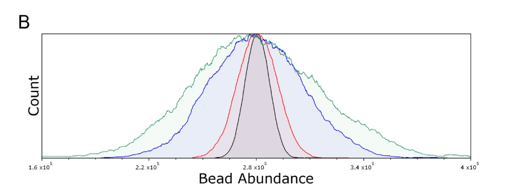

The way TRU-OLS seems to work relies on the unmixing controls (single color and unstained). Single colors are used to provide the signatures for the full matrix. The unstained is then unmixed against this matrix. A cutoff point is then set at the 99.5% (very right edge) of the spread. This cutoff is used to help determine for individual cells what fluorophores are present before downsizing the matrix to only the relevant fluorophores.  2/n

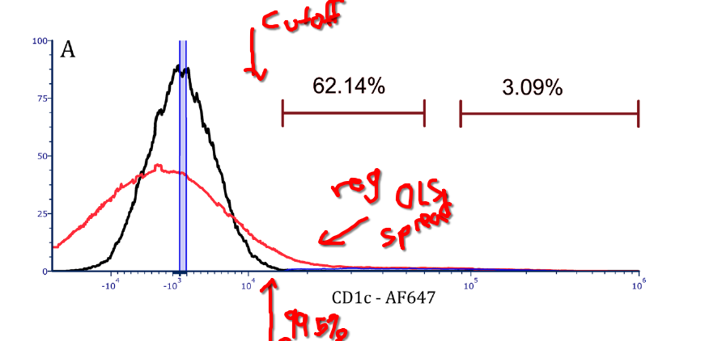

Consequently, for the full-stained sample, each cell is initially unmixed. If the value is below the cutoff set by the unstained spread, the marker is presumed negative and removed from the re-unmix matrix.  Once all the "irrelevant" fluors are removed, the full-stained cell is reunmixed with the remaining fluorophore matrix. 3/n

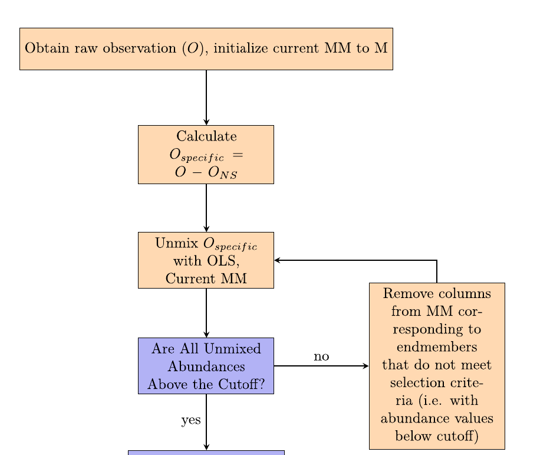

Finally, the "irrelevant" fluorophores on the re-unmixed cell can be either set to 0, or reorganized into the original spread of the unstained negative. 4/n

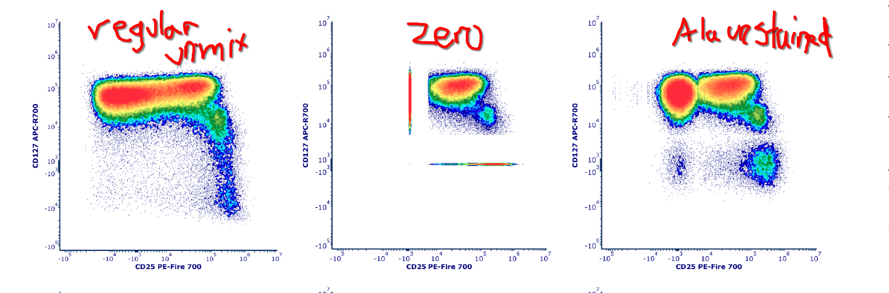

When enumerating how many markers were retained for the individual re-unmixing, we see following distribution of "smaller matrices used". 5/n:

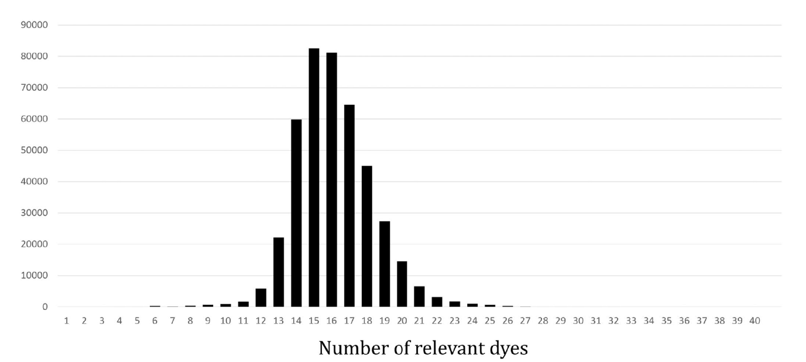

In addition to removing all events below the cutoffs, the removal of "irrelevant" markers results in the Bermuda zone between the cutoff and the bright population to also clean up when comparing between regular OLS unmixing and the TRU-OLS approach. 6/n.

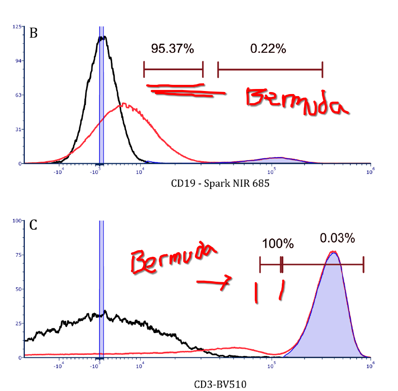

The approach makes the most difference on cells where there wasn't much marker co-expression to begin with. For the heavily co-expressed cells, everything is kept, and their uncertainty still persist as spread. 7/n.

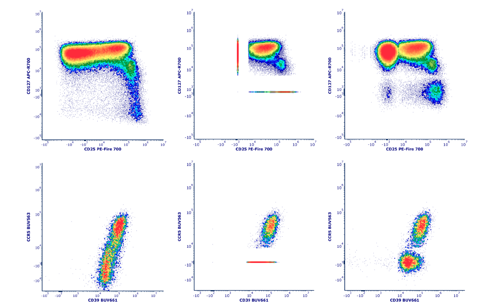

My outstanding questions is one, if we are depending on the positive peaks remaining in the same place based on the reference, how does this work for cells across multiple individuals in practice. Likewise, I will need to play around with more dim population data before I can vouch haven't also thrown the baby out with bathwater. With that said, I like it. 

# Walk-through

## Setup

Before getting started, let's make sure that both the Julia programming language is installed on our local computer, and then  proceed to download TRU-OLS and make sure it is active in our local environment. 

### Installing Julia

Since how you install [Julia](https://julialang.org/) will vary depending on your computer [operating system](/course/00_WorkstationSetup/index.qmd), please see these [instructions](/course/community/TRU-OLS/InstallingJulia.qmd). Once Julia has been successfully installed, please return and proceed to the next step. 

### Downloading TRU-OLS

As of the moment, TRU-OLS is available via [GitHub](https://github.com/De-Novo-Research/TRU-OLS). Consequently, we are able to download it similar to any GitHub-based code to make it available on our local computer. To simplify the installation process (and allow us to make any necessary changes should we encounter dependency version issues later on), I recommend going ahead and forking the repository. This additionally helps the authors track usage and community interest in their work. 

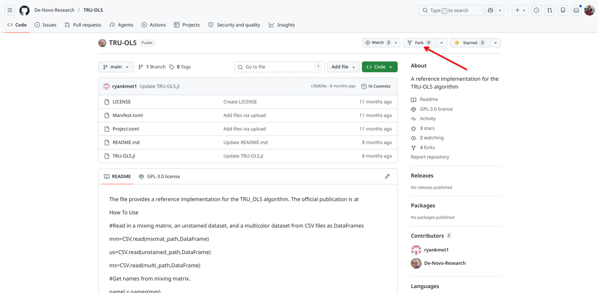

After forking the project to your own GitHub account, copy the url, open up [Positron](/course/00_Positron/index.qmd), and select the drop-down option on the upper-right to create a New Folder from Git. 

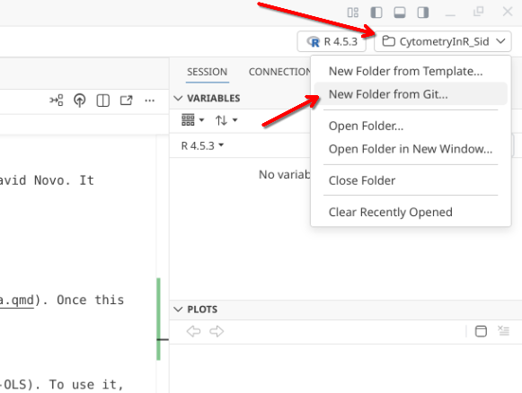

Paste in the url to your forked version of TRU-OLS, and proceed with the download. 

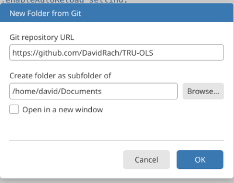

Following completion, open the new project folder inside Positron. 

### Activating TRU-OLS

To begin using TRU-OLS, just like any R package, we are going to need to make sure the required dependencies are installed. These are documented inside the "Manifest.toml" file. To get started, proceed to your **terminal tab** and run the following line of Julia code

```{r}
#| eval: FALSE

# Julia code
julia --project=.
```

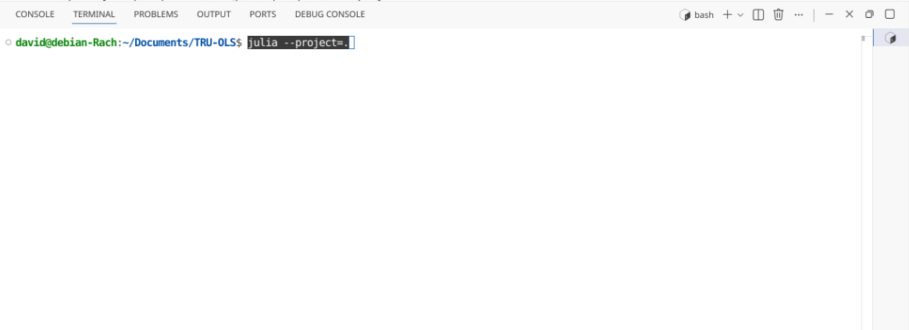

The Julia splash screen will then be displayed within the terminal window

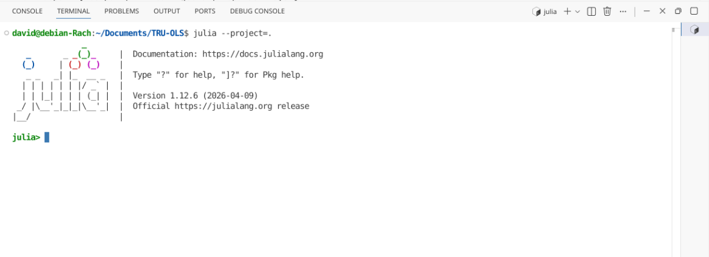

Now that Julia is active in our terminal, we will see julia> appearing on each line. Proceed to type (or paste) the following code to commence the installation of the required dependencies. 

```{r}
#| eval: FALSE

# Julia code
using Pkg
Pkg.instantiate()
```

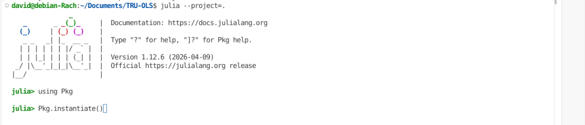

The installation of the required Julia packages will then proceed, with the status of the various steps (including installation and pre-compiling) being displayed

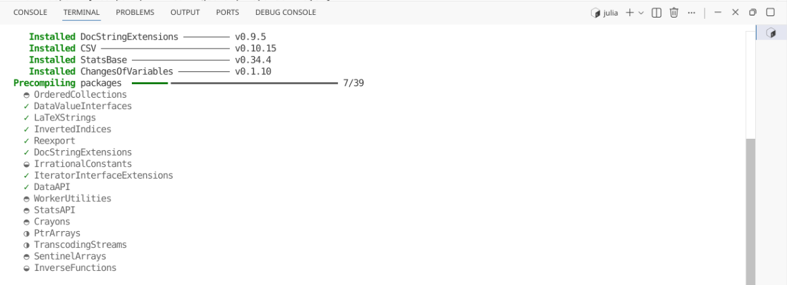

In my attempt to install the dependencies, I ended up with an error when installing the CSV package. 

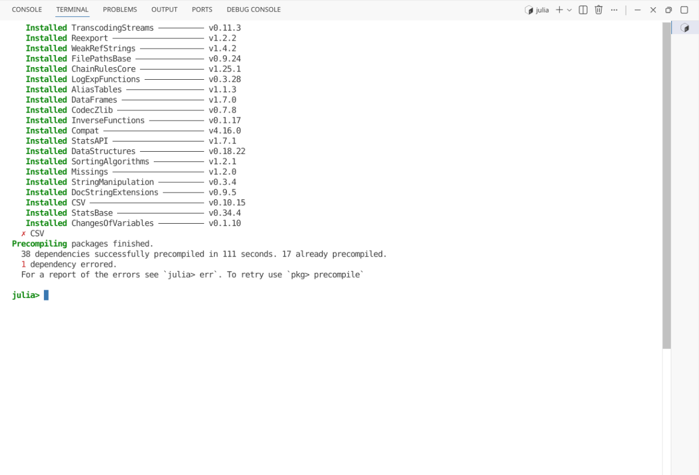

```{r}
#| eval: FALSE

# Julia code
err
```

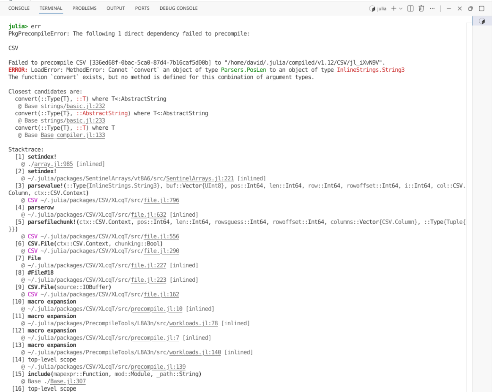

Similar to when we encounter errors installing an R package, we can apply those same troubleshooting skills in this context. First glancing at the "Manifest.toml" file, the original manifest list the Julia version 1.8.5. In my case, my installed Julia version was more recent (1.12.6), suggesting we likely have a dependency clash due to the older version listed in the manifest. 

I decided to re-run `Pkg.instantiate()`, and as we would anticipate, I still retrieved the previous error

```{r}
#| eval: FALSE

# Julia code
using Pkg
Pkg.instantiate()
```

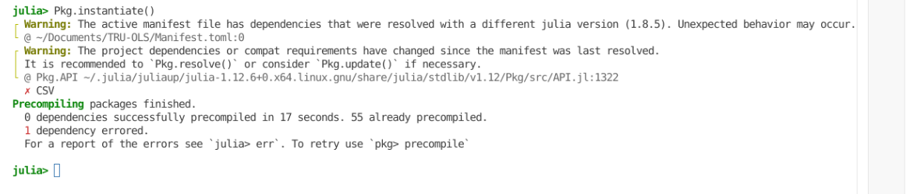

However, in this case, the message output suggested the use of `Pkg.resolve()`, which I next attempted

```{r}
#| eval: FALSE

# Julia code
using Pkg
Pkg.resolve()
```

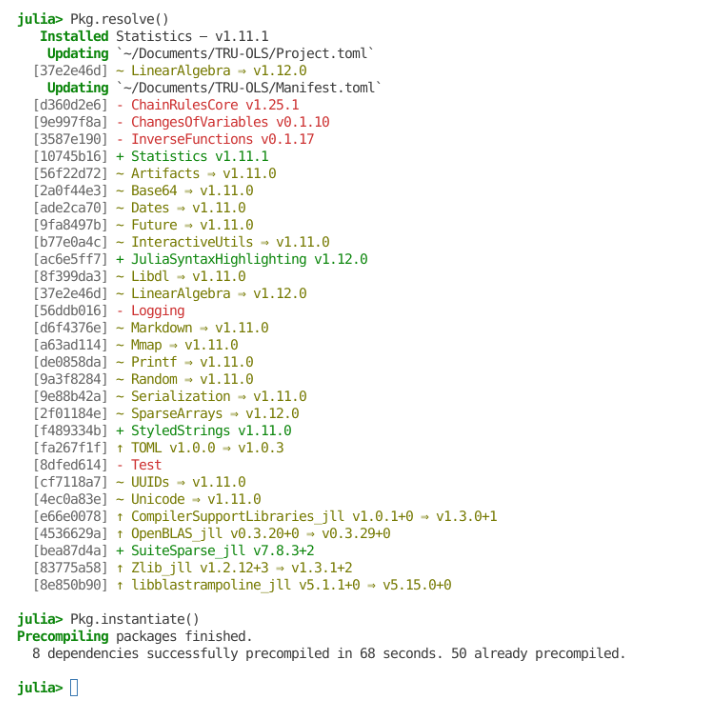

Based on the Positron highlighting syntax, this resulted in a few package additions and deletions. On re-running `Pkg.instantiate()`, the CSV package successfully installed. 

Checking the Source control tab in the actions bar, and clicking on the "Manifest.toml" file, we can see the different updates that were effectuated by `Pkg.resolve()`

Once this was done, I saved my changes to the files, staged them to version control, wrote a short commit message, before pushing everything from my local fork back to GitHub. This prevents the need to repeat the troubleshooting process next time I needed to set TRU-OLS up on another computer in the future. 

## Dataset

For this walkthrough, the spectral flow cytometry .fcs files being used were generated in 2025 as part of the yearly [5-day training workshop](https://umgccfcss.github.io/BISCC_2025/Day1_5L.html) here at [UMGCCC FCSR](https://www.medschool.umaryland.edu/cibr/core/umgccc_flow/). The panel consisted of 5 markers (CD45, CD3, CD4, CD8 and Viability). This panel was used to stain mouse splenocytes, which were then acquired on a 5-laser Cytek Aurora. 

## Loading FCS files to GatingSet

With both Julia and TRU-OLS now installed, switch back to the R project folder that you will be primarily be working in for unmixing.Once there, you will need to load your unmixing controls and full-stained samples into a GatingSet. 

As always, start by attaching to your local environment the required R packages via the `library()` call

```{r}
library(flowWorkspace)
library(flowGate)
library(dplyr)
library(purrr)
library(JuliaCall)
```

Next off, specify the storage location of the .fcs files, and also the location of the folder you want any unmixed fcs files to be saved to.

```{r}
#StorageLocation <- file.path("course", "community", "TRU-OLS", "data")
StorageLocation <- file.path("data")

#OutputLocation <- file.path("course", "community", "TRU-OLS", "outputs")
OutputLocation <- file.path("outputs")
```

Proceed to load the identified .fcs files into a GatingSet object

```{r}
fcs_files <- list.files(StorageLocation, pattern=".fcs",
 full.names=TRUE, recursive=TRUE)

SFC_cytoset <- load_cytoset_from_fcs(fcs_files,
 truncate_max_range=FALSE, transformation=FALSE)
SFC_GatingSet <- GatingSet(SFC_cytoset)
```

As we will be working with raw .fcs files for the unmxing process, **we do not need to transform**, as we need signatures retrieved from the underlying data to appear in their normal shapes.

I recommend then using `subset()` on the GatingSet, placing the single-color and unmixing controls into their own GatingSets, and repeating the process for the full-stained samples. This ensures we only retrieve signatures from the single-color controls, and that only the full-stained samples are unmixed.

```{r}
# pData(SFC_GatingSet)

FullStain_GS <- subset(SFC_GatingSet, name == "Full-Stained2_scatter.fcs")

Unstained_GS <- subset(SFC_GatingSet, name == "Unstained (Cells)_scatter.fcs")

UnmixingControl_GS <- subset(SFC_GatingSet, name != "Full-Stained2_scatter.fcs" &
   name != "Unstained (Cells)_scatter.fcs")
```

## Signature Matrix

To facilitate this example, we will use the `Luciernaga_SingleColors()` function from the `Luciernaga` package to retrieve the signatures from our single-color controls. For more information, please see the [vignette](https://davidrach.github.io/Luciernaga/articles/Unmixing.html#luciernaga_singlecolors).

```{r}
# remotes::install_github("DavidRach/Luciernaga")
library(Luciernaga)

# Define the primary detectors

UnmixingPanel <- data.frame(
  Fluorophore = c("BV510-A", "BV605-A", "Spark Blue 550-A", "7-AAD-A", "Alexa Fluor 700-A"),
  Detector = c("V7-A", "V10-A", "B3-A", "YG4-A", "R4-A"))

# Define what brightness percentiles to include

ThePanelCuts <- UnmixingPanel |> select(-Detector) |> mutate(From=0.8) |> mutate(To=1)

# Extract the signatures 

SCs <- map(.x=UnmixingControl_GS, .f=Luciernaga_SingleColors, sample.name="TUBENAME",
 removestrings=c(".fcs", "PD_AD_"), subset="root", PanelCuts=ThePanelCuts, stats="median", Verbose=FALSE, 
 SignatureView=TRUE) |> bind_rows()
```

```{r}
SCs
```

Let's also visualize the signatures against the reference signatures for the respective fluorophores to ensure that the retrieved signatures are appropiate. 

```{r}
plots <- map(.x=UnmixingControl_GS, .f=Luciernaga_SingleColors, sample.name="TUBENAME",
 removestrings=c(".fcs", "PD_AD_"), subset="root", PanelCuts=ThePanelCuts, stats="median", Verbose=FALSE, SignatureView=TRUE, returntype="plots")
```

```{r}
plots
```

In this case, the signatures are close enough to the reference that we can proceed (the rough edges are likely result of the datasets single-color unmixing controls being [severely downsampled](/course/community/TRU-OLS/FCSCleanUp.qmd) in order to pass the GitHub size limits)

## OLS-Unmixing via Luciernaga

Since we may be interested in comparing how TRU-OLS unmixing differs compared to regular OLS unmixing (and since we have already generated the needed inputs), lets proceed to unmix via `Luciernaga` and generate an .fcs file to our designated outputs folder for later. 

```{r}
TheSampleName <- c("TUBENAME")

UnmixSuccess <- map(.x=FullStain_GS, .f=Luciernaga_Unmix,
 controlData=SCs, sample.name=TheSampleName, addon="_Luciernaga_Unmixed", subset="root", removestrings="fcs", outpath=OutputLocation, PanelPath=UnmixingPanel, Verbose=TRUE)
```

## TRU-OLS Unmixing

Within the [TRU-OLS](https://github.com/De-Novo-Research/TRU-OLS) README, we are given a few line of codes with instructions on how to run

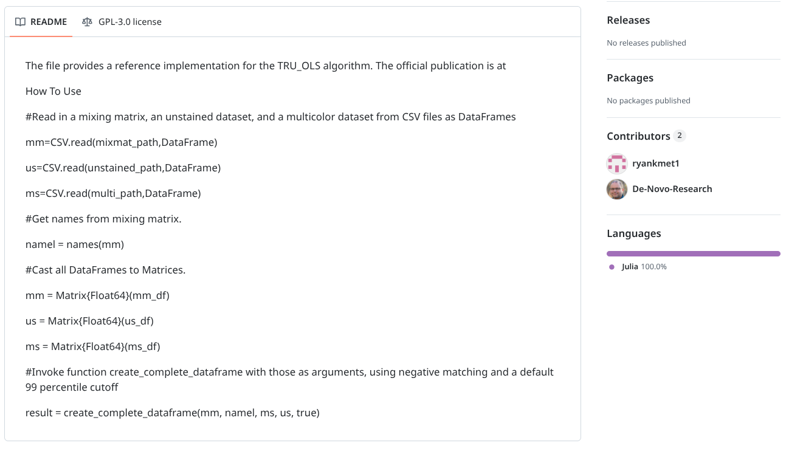

The main inputs are three csv files that are read into JUlia, mixmat (the signature matrix of the single-colors), unstained (the cleaned up exprs output for the unstained sample), and multi (the cleaned up exprs outputs for the full-stained sample). The names of the fluorophores are then subsequently retrieved from the mixmat file. 

These data.frames are then all converted to matrices, before being passed off to `create_complete_dataframe()` function, which runs using the default parameters. 

From previous function building [examples](/course/10_Downsampling/index.qmd), we have enough familiarity with the `flowWorkspace` package to figure out how to retrieve and clean up the `exprs()` output in R to fulfill the inputs needed for unstained and full-stained samples to be passed to Julia. We can also use `Luciernaga_SingleColors()` to generate the mixmat data.frame of fluorophore signatures. 

After attempting (and failing) to pass from an R code chunk to a Julia code chunk, I found the implementable approach was to write the data.frames to .csv files, and then via `JuliaCall` package run Julia commands within the R function to carry out the above README suggested steps, and save the output as a .csv file that could be read back into R. 

The main thing needed was to provide the correct file path to the TRU-OLS.jl file with the corresponding Julia code. 


```{r}
#' Implements TRU-OLS unmixing in Julia, via the JuliaCall R package. 
#' 
#' @param mixmat The signature matrix
#' @param unstained The cleaned up exprs of the unstained
#' @param fullstained The cleaned up exprs of the full-stained
#' @param TRUOLSPATH File.path to the TRU-OLS.jl file
#' 
#' @importFrom JuliaCall julia_setup julia_command 
#' @importFrom utils read.csv write.csv
#' 
TRU_OLS_Julia <- function(mixmat, unstained, fullstained,
 TRUOLSPath="/home/david/Documents/TRU-OLS/TRU-OLS.jl") {

  library(JuliaCall)
  write.csv(mixmat,      "mixmat.csv",      row.names=FALSE)
  write.csv(unstained,   "Unstained.csv",   row.names=FALSE)
  write.csv(fullstained, "FullStained.csv", row.names=FALSE)
  
  julia_setup()
  julia_command('import Pkg; Pkg.add(["CSV", "DataFrames", "LinearAlgebra", "StatsBase", "FileIO", "FCSFiles"])')
  julia_command('using CSV, DataFrames')
  julia_command('mm = CSV.read("mixmat.csv", DataFrame)')
  julia_command('us = CSV.read("Unstained.csv", DataFrame)')
  julia_command('ms = CSV.read("FullStained.csv", DataFrame)')
  julia_command('namel = names(mm)')
  julia_command('mm = Matrix{Float64}(mm)')
  julia_command('us = Matrix{Float64}(us)')
  julia_command('ms = Matrix{Float64}(ms)')
  julia_command(sprintf('include("%s")', TRUOLSPath))
  julia_command('result = create_complete_dataframe(mm, namel, ms, us, true)')
  julia_command('CSV.write("result.csv", result)')
  
  result_r <- read.csv("result.csv", check.names=FALSE)
  return(result_r)
}
```

With the "R to Julia and back to R" hand-off operational, the main thing left is to provide the function infrastructure in R needed to gather the required inputs, and then once the outputs are received, correctly package them back into a new .fcs file. I modified the [existing function](https://github.com/DavidRach/Luciernaga/blob/main/R/Luciernaga_Unmix.R) infrastructure for  `Luciernaga_Unmix()` used for the OLS unmixing example above, but switching out the OLS unmixing with the `TRU_OLS_Julia()` function we just wrote. 

```{r}
#' @param x An interated-in full-stained raw .fcs file needing to be unmixed
#' @param SCs The fluorophore signature matrix generated via Luciernaga_SingleColors
#' @param Unstained_GS The GatingSet containing the raw unstained fcs file
#' @param sample.name The keyword containing the fcs file name
#' @param removestrings A list of values to remove from name
#' @param Verbose For troubleshooting name after removestrings
#' @param addon Additional addon to append to the new .fcs file name
#' @param subset A gating hierarchy level to sort cells at, expression values retrieved
#' from these
#' @param outpath The return folder for the .fcs files
#' @param PanelPath Location to a panel.csv containing correct order of fluorophores
#' @param returnType Whether to return "fcs" or "flowframe"
#' @param TRUOLSPATH File.path to the TRU-OLS.jl file
#' 
#' @importFrom JuliaCall julia_setup julia_command 
#' 
TRUOLS_Unmix <- function(x, SCs, Unstained_GS, sample.name, removestrings,
   Verbose, addon, subset="root", outpath, PanelPath, returnType="fcs",
   TRUOLSPath = "/home/david/Documents/TRU-OLS/TRU-OLS.jl"){

  # File Name Clean Up

  if (length(sample.name) == 2){
      first <- sample.name[[1]]
      second <- sample.name[[2]]
      first <- keyword(x, first)
      second <- keyword(x, second)
      name <- paste(first, second, sep="_")
    } else {name <- keyword(x, sample.name)}

    name <- NameCleanUp(name, removestrings=removestrings)
    if (Verbose == TRUE){message("After removestrings, name is ", name)}

  # Normalize the Single Color Signature Matrix (important for final scaling)

  if (any(SCs |> select(where(is.numeric)) > 1)){
    Metadata <- SCs |> select(!where(is.numeric))
    Numerics <- SCs |> select(where(is.numeric))
    n <- Numerics
    n[n < 0] <- 0
    A <- do.call(pmax, n)
    Normalized <- n/A
    SCs <- bind_cols(Metadata, Normalized)
 }

    # Formating SingleColors to required mixmat format
    SCsM <- t(SCs)
    mixmatDF <- data.frame(SCsM)
    colnames(mixmatDF) <- mixmatDF[1,]
    Ligands <- mixmatDF[2,] |> unlist() |> unname()
    mixmatDF <- mixmatDF[3:nrow(mixmatDF),]
    mixmat_mat <- as.matrix(mixmatDF)

    # Extracting the Unstained Detectors exprs values
    Unstained <- gs_pop_get_data(Unstained_GS, "root")
    Unstained <- flowCore::exprs(Unstained[[1]])
    UnstainedDF <- data.frame(Unstained, check.names=FALSE)
    UnstainedDF <- UnstainedDF[!stringr::str_detect(names(UnstainedDF), "FSC|SSC|Time")]
    Unstained_mat <- as.matrix(UnstainedDF)

    # Extracting the Full-Stained Detectors exprs values
    FullStainedCS <- gs_pop_get_data(x, "root")
    FullStained <- flowCore::exprs(FullStainedCS[[1]])
    FullStainedDF <- data.frame(FullStained, check.names=FALSE)
    StashedDF <- FullStainedDF[stringr::str_detect(names(FullStainedDF), "FSC|SSC|Time")]
    FullStainedDF <- FullStainedDF[!stringr::str_detect(names(FullStainedDF), "FSC|SSC|Time")]
    FullStained_mat <- as.matrix(FullStainedDF)

    # Unmixing via the R-Julia wrapper function
    TheUnmixed <- TRU_OLS_Julia(mixmat=mixmat_mat, unstained=Unstained_mat,
    fullstained=FullStained_mat, TRUOLSPath = TRUOLSPath)

    # Returning Time, FSC, SSC columns back in to the unmixed file
    TheOrder <- SCs |> pull(Fluorophore)
    TheLigands <- SCs |> pull(Ligand)
    TheUnmixed <- TheUnmixed[, TheOrder]
    TheData <- cbind(StashedDF, TheUnmixed)
    rownames(TheData) <- NULL
    StandInStashed <- StashedDF |> mutate(Backups=row_number()) |> relocate(Backups, .before=1)

    # Handoff to Luciernaga Internal Unmix for the .fcs formatting
    new_fcs <- Luciernaga:::InternalUnmix(cs=FullStainedCS,
    StashedDF=StandInStashed, TheData=TheData, Ligands=TheLigands)

    # Modifying the filename
    if (!is.null(addon)){name <- paste0(name, addon)}
    AssembledName <- paste0(name, ".fcs")
    new_fcs@description$GUID <- AssembledName
    new_fcs@description$`$FIL` <- AssembledName

    # Sending the file out as an .fcs file
    if (is.null(outpath)) {outpath <- getwd()}
    fileSpot <- file.path(outpath, AssembledName)
    if (returnType == "fcs") {write.FCS(new_fcs, filename = fileSpot, delimiter="#")
    } else {return(new_fcs)}
}
```

With both the main function (and the internal R-Julia handoff function) written and active in our environment, we can now proceed to unmixing. 

```{r}
#| eval: FALSE
UnmixSuccess <- map(.x=FullStain_GS, .f=TRUOLS_Unmix, SCs=SCs, Unstained_GS=Unstained_GS, 
 sample.name=TheSampleName, addon="_TRUOLS_Unmixed", subset="root",
 removestrings="fcs", outpath=OutputLocation, PanelPath=UnmixingPanel, Verbose=TRUE)
```

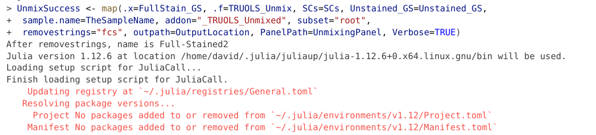

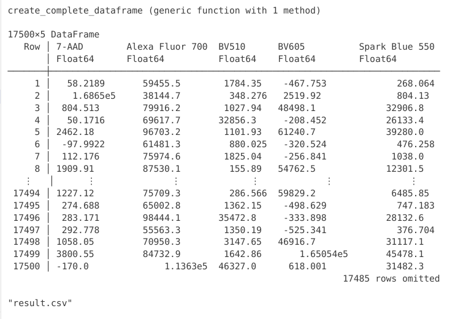

And for a quick sanity check, lets check both the OLS and TRU-OLS files to make sure that the .fcs file formatting worked in practice. 

OLS 

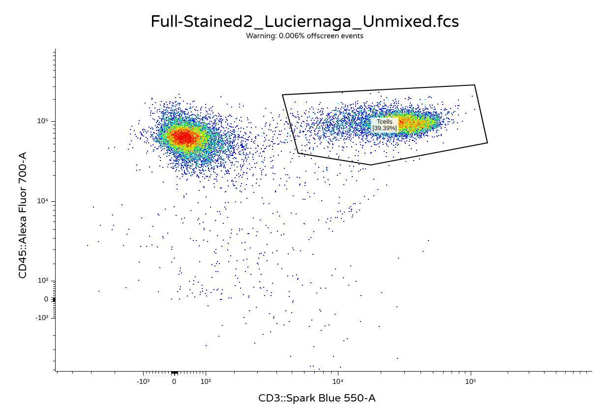

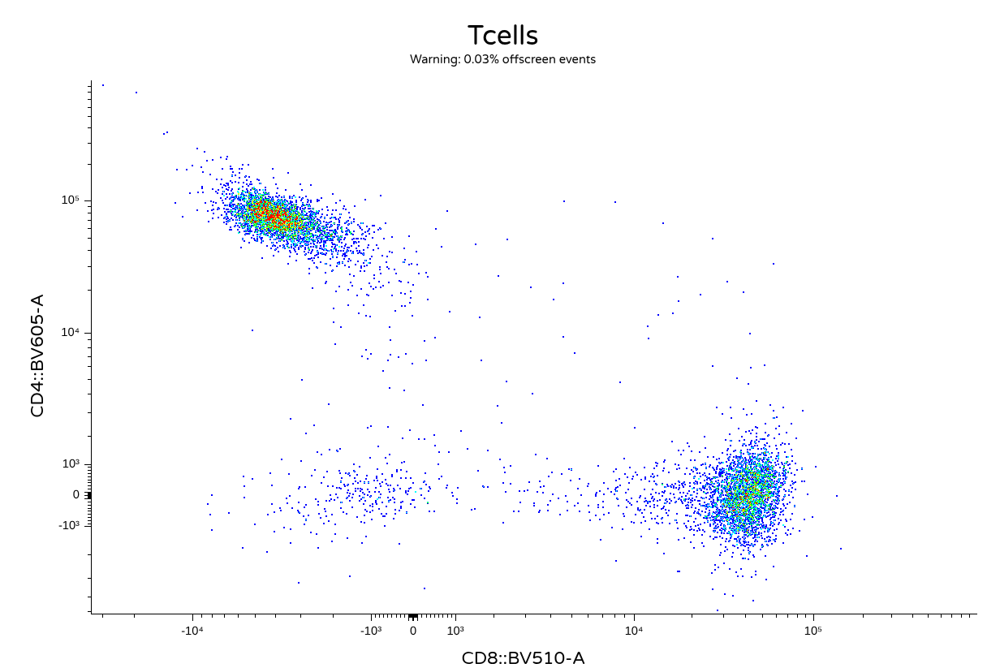

TRU-OLS

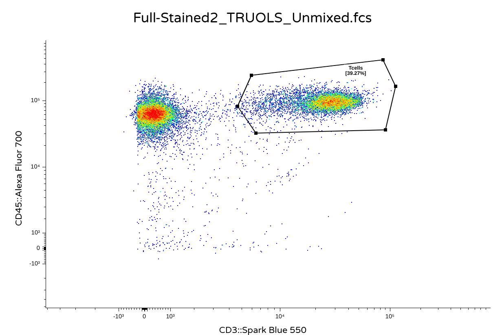

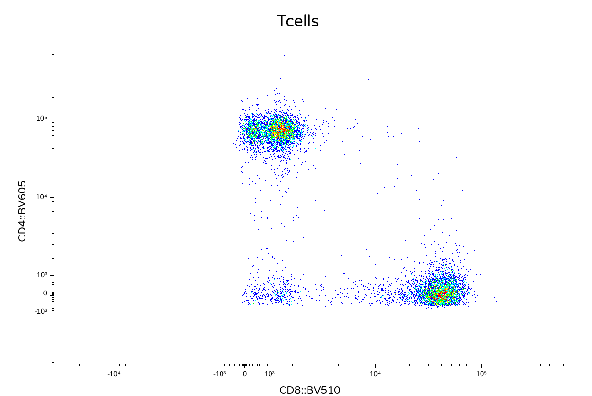

# Take Away

In this walk-through, we showcased how to install Julia, activate TRU-OLS within a Positron project folder, and then leverage our existing knowledge about flow cytometry infrastructure as implemented in R via the `flowWorkspace` package to gather the required inputs. We then wrote a small helper and wrapper function to handoff these inputs to Julia for unmixing, before returning them to R for formatting and export out as .fcs files. 

Obviously, this is an initial implementation, and several areas could use additional improvements. This entire process was single-threaded, and could benefit from parallel computing implementation to take advantage of most computers having multiple cores. Additionally, the use of `JuliaCall` as an intermediate introduces some lag as it gets reactivated on each iteration. 

And this has only been checked on Cytek Aurora files, so its likely some changes need to be implemented for other manufacturers. 

Regardless, as with all the course code, all the above is AGPL3-0 licensed, and you are free to customize it to your hearts content. We gladly welcome any modifications/contributions to make the above coding examples more robust in the future. 

Hopefully, this lowers the barrier of entry, so that anyone interested in exploring how the TRU-OLS method of unmixing might differ for their own datasets is able to gnerate a quick example for evaluation. 

Cheers!
David

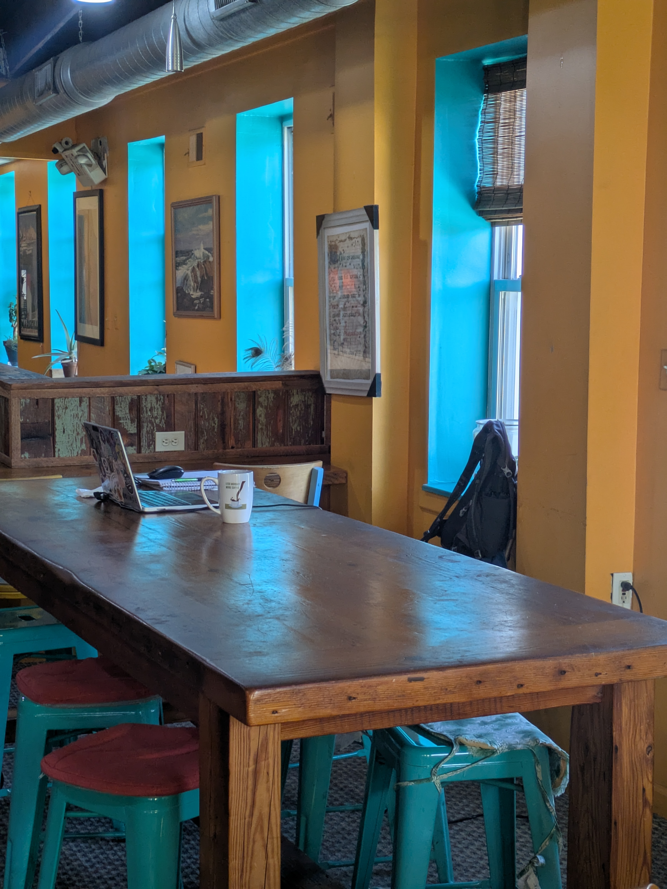

# Additional Resources

[Reducing Spreading: Removing the Impact of Irrelevant Dyes Improves Unmixed Flow Cytometry Data](https://onlinelibrary.wiley.com/doi/10.1002/cyto.a.24957) The original paper describing TRU-OLS, describing the methodology. If you are trying to customize the function further to take advantage of some of the non-default options, worth checking out. 

[Introduction to Julia for R users](https://nrennie.rbind.io/blog/introduction-julia-r-users/) A blogpost by Nicola Rennie, covering some of the intro to Julia details that R users would appreciate knowing

[Unmixing with Luciernaga](https://davidrach.github.io/Luciernaga/articles/Unmixing.html) The walk-through vignette documenting how to use the `Luciernaga` unmixing helper functions (still under development)

```{r}
#| eval: FALSE
#| include: FALSE

print("Goodbye")
```

::: {style="text-align: right;"}
[](https://www.gnu.org/licenses/agpl-3.0.en.html) [](http://creativecommons.org/licenses/by-sa/4.0/)
:::
